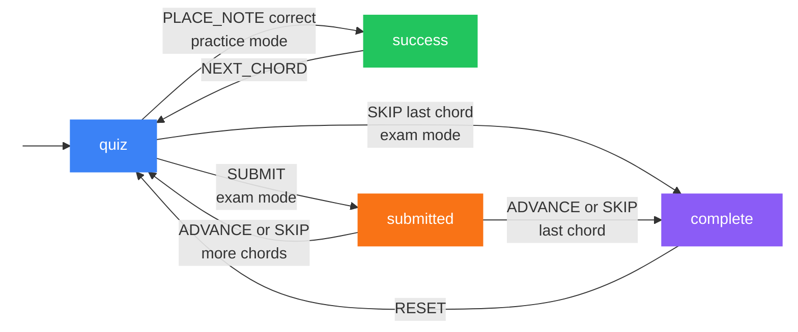

# Quiz State Machine

The quiz flow is modelled as an XState machine in `src/components/QuizController/quizMachine.ts`.

> Internal transitions that stay in `quiz`: `PLACE_NOTE` (incorrect, or exam mode), `TOGGLE_OPEN_MUTE`, `CLEAR`, `NEXT_CHORD` (practice loops), `RESET`

## States

| State | Description |
|-------|-------------|
| `quiz` | Actively placing notes on the fretboard |
| `success` | Practice mode: correct answer — overlay shown, fretboard disabled |
| `submitted` | Exam mode: answer submitted — correct/incorrect overlay shown |
| `complete` | Exam mode: all chords done — end screen with score and skipped chords |

## Mode differences

**Practice mode** (`PLACE_NOTE` auto-validates on every note — transitions to `success` immediately on correct answer. Queue loops and reshuffles. No scoring.)

**Exam mode** (No auto-validation. All strings start selected-open. `SUBMIT` triggers validation. Queue runs once. Score tracked. `complete` state shows results.)

## Guards

| Guard | Description |
|-------|-------------|
| `isExam` | `context.mode === "exam"` |
| `practiceNoteCorrect` | Peeks at post-placement validation result |
| `isLastChord` | `currentIndex + 1 >= chordQueue.length` |
